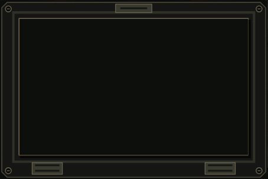
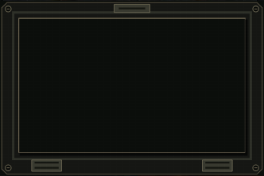
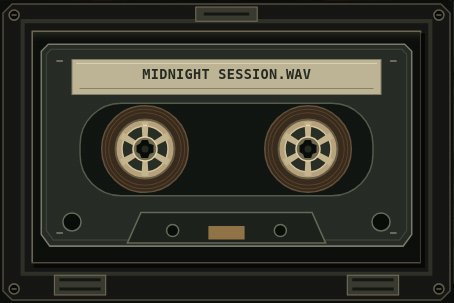
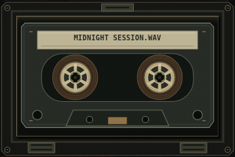
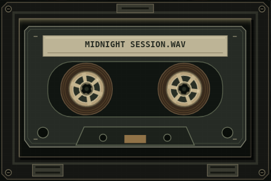
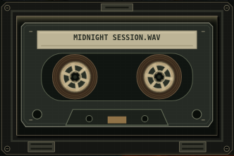

# Cassette rebuild

Branch: `cassette-rebuild`, based on `090927` at
`a8963da652d7e75fa317a33c0356038839977f93`.
This document supersedes the cassette construction and layer requirements in
`UI_PIXEL_200826_SPEC.md`. Transport, audio, crate and pitch remain unchanged.

## Ownership and scope

The removed responsibility is reconstructing one cassette from unrelated parts
of the workstation skin, pseudo-elements, a glass overlay and mobile crop
calibration. `css/looper.css` owns the component before and after. No JavaScript
file, shared state, loading, play/stop function or event hook changes.

The retained hooks are `.cassetteMechanism`, `.cassetteReelLeft`,
`.cassetteReelRight`, `#cassetteBeatName`, `.loaded`, `.playing` and the existing
rate-driven reel duration variables. A single owner, intrinsic vector sizes and
one coordinate system make geometry editable without inspecting another skin.

## Construction

The mechanism uses a 900 × 600 coordinate system (3:2) at every viewport. Mobile
changes only the mechanism's position and width. All interior coordinates are
identical. Its opaque cavity prevents the cassette already printed in the
unchanged workstation skin from leaking through, including EMPTY.

| Element | Asset | Layer |
| --- | --- | ---: |
| Cavity | Opaque mechanism background | 0 |
| Cassette body and wound tape | `cassette-tape.svg` | 1 |
| Left/right reels | Two instances of `cassette-reel.svg` | 2 |
| Blank paper label | `cassette-label.svg` | 3 |
| Beat name | Existing HTML and JS hook | 4 |
| Edge light | CSS opacity | 5 |
| Open door frame | `cassette-frame.svg` | 6 |

All assets live in `assets/looper-ui/`. They are original vectors without raster
images, filters, external references or baked track names. The door aperture is
transparent; there is no glass overlay. Both reel centres match the tape asset
at (288,294) and (612,294), with a shared 128 × 128 reel asset.

| State | Visible contents | Motion |
| --- | --- | --- |
| EMPTY | Cavity and door only | None |
| LOADED | Cassette, tape, paper, title, reels and subtle edge light | Reels paused |
| PLAYING | Same geometry with stronger edge light | Reels rotate at the existing playback-rate durations |

Reduced motion disables reel animation. Decorative images have empty alt text
and are hidden from accessibility APIs. The existing readout and controls retain
track details, state and keyboard behavior.

## Regression references

| State | Desktop | Mobile |
| --- | --- | --- |
| Empty |  |  |
| Loaded |  |  |
| Playing |  |  |

`tests/cassette_contract.py` checks asset independence, decorative semantics and
single stylesheet ownership. `tests/cassette_states.py` exercises real PLAY/STOP,
empty → loaded → playing → stopped → empty, both reel rotations, matching
proportional geometry, layer order, no overflow, long names and reduced motion.
It covers widths 320, 390, 680, 681, 820 and 1440. It also hides the underlying
skin and requires the empty cavity screenshot to remain pixel-identical.

The regular test compares screenshots against committed references with bounded
antialias/font tolerance. To deliberately update them after visual review:

```sh
UPDATE_CASSETTE_REFERENCES=1 python3 tests/cassette_states.py
```

Only the reel animation clock is paused at 400 ms for the PLAYING screenshot;
the transport has been started through the actual button, and rotation was
verified before freezing the clock. Current renders go to `test-artifacts/` and
are uploaded by the existing Actions job.

## Validation notes

The initial local baseline passed the static, unit audio, CSS and HTTP gates;
Playwright was unavailable. Installing Playwright and standalone Chromium did
not make the browser launch in this local environment (SIGTRAP). Browser
validation therefore runs in GitHub Actions, with the executable resolved from
Playwright's installed Chromium rather than assuming `/usr/bin/chromium`.

The first Actions run (#352) passed all audio/Chopper/Drum tests and
`browser_smoke.py`, then exposed a pre-existing `asset_render.py` assertion
requiring button gradients. The unchanged `090927` transport CSS and its static
contract explicitly require transparent native hotspots over dedicated artwork.
The test now checks that documented rendering path; no transport CSS changed.

Actions run #354 passed the focused cassette suite at all six widths and
produced the six references above. All six images and the full desktop view
were visually inspected before committing them. The same run exposed a second
stale transport assertion expecting a 2 px key offset absent from the unchanged
CSS. That assertion now verifies real native `:active` keyboard activation;
the subsequent keyboard release must still start playback and reel animation.

The committed workflow does **not** regenerate references. Final acceptance
requires the full Project checks run to pass on the PR head, including the
comparison against these inspected images. No local browser pass is claimed.
